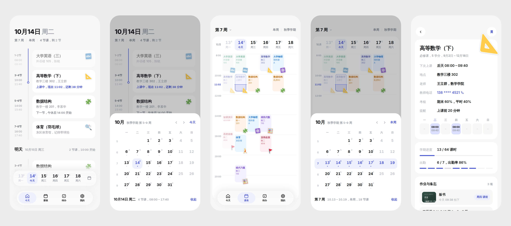
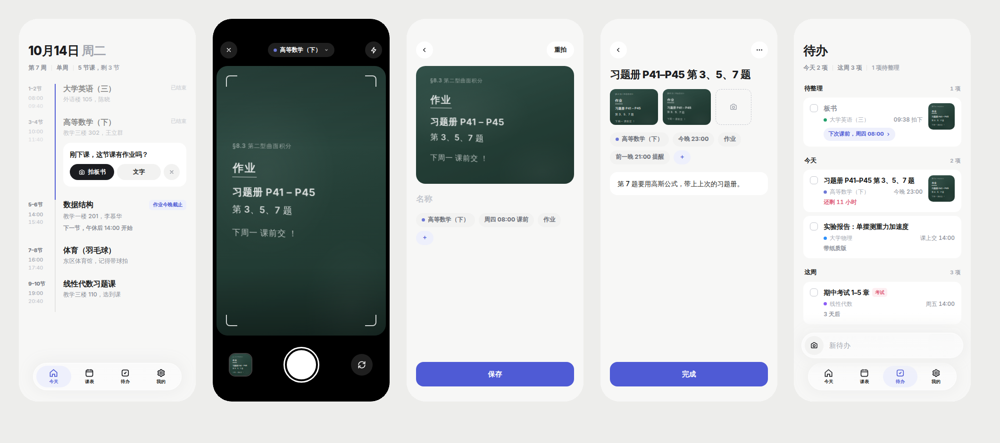
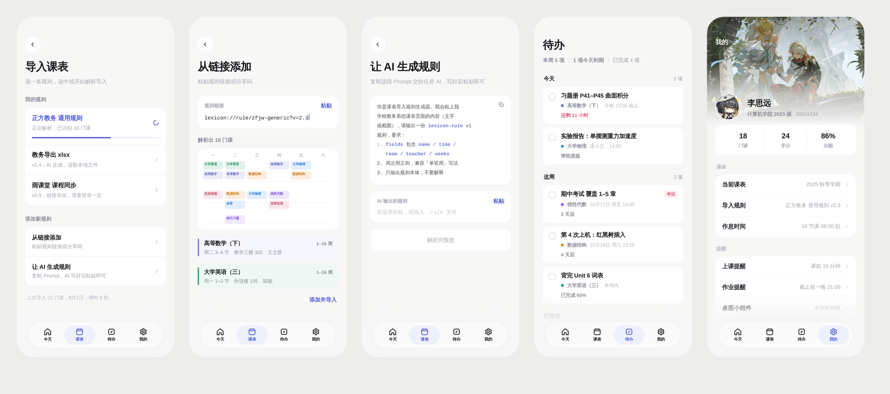
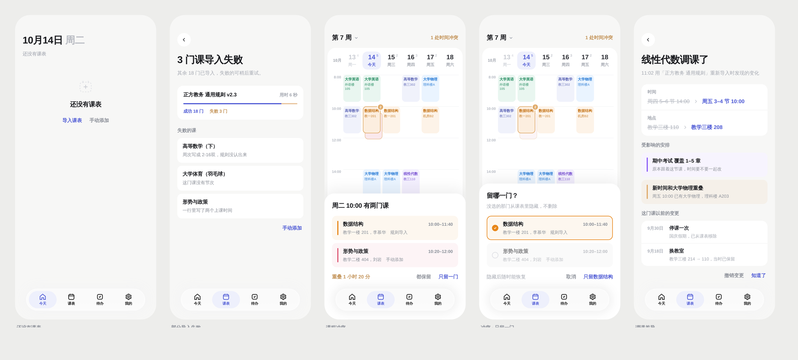
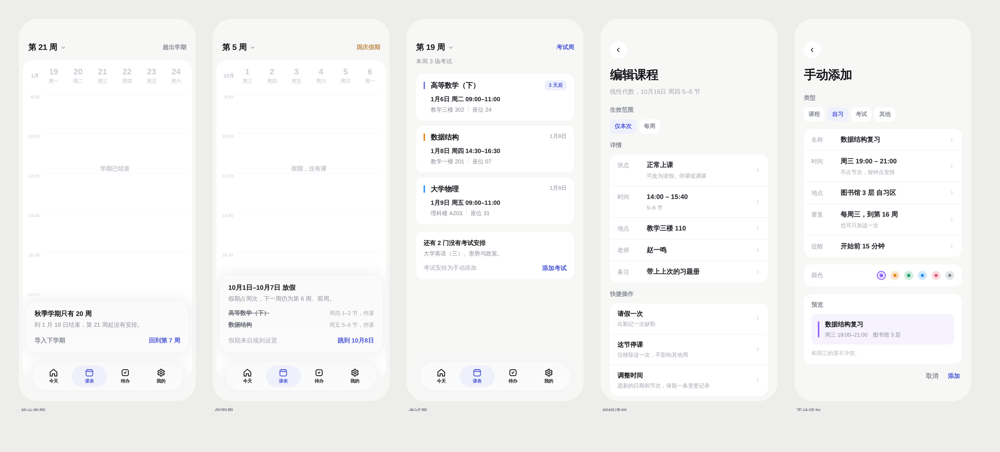
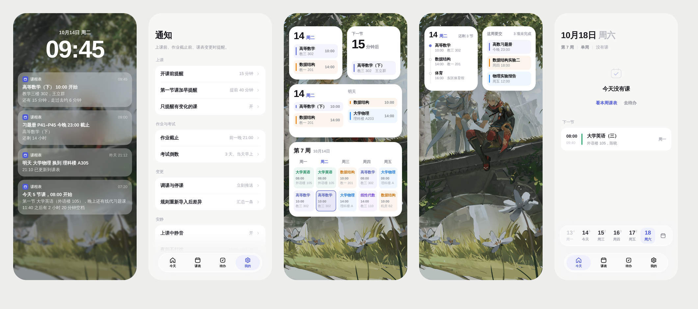
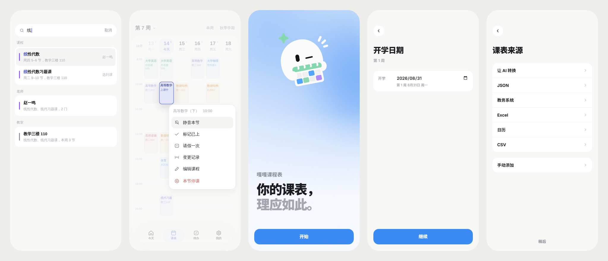

# 嘎嘎课程表

**你的课表，理应如此。**

今天 / 周视图 / 待办 / 冲突处理 / 变更记录 / 多源导入 / AI 转换 / 桌面小组件


</div>

## 截图

### 今天 / 周视图 / 课程详情



### 下课随手记 / 拍板书 / 待办



### 导入 / AI 转换 / 待办 / 我的



### 空状态 / 导入失败 / 时间冲突 / 变更记录



### 学期边界 / 假期 / 考试周 / 编辑 / 手动添加



### 通知 / 锁屏 / 桌面小组件



### 搜索 / 长按菜单 / 开学日期 / 课表来源



## 功能

**今天**
- 按节次排布的当日时间线，已结束、上课中（剩余分钟）、下一节倒计时一目了然
- 明天预览；周六日、假期、学期外各有独立空状态
- 底部日期条搭配从底部滑出的月历面板，与学期周次对齐

**课表**
- 周视图网格，正在上的课高亮，单双周、假期、考试周均有标注
- 时间重叠自动检测，支持「都保留」或「只留一门」决策，被隐藏的课可随时恢复
- 长按课程卡片可静音本节、标记已上、请假一次、查看变更记录、编辑课程或停课

**课程**
- 详情页展示下次上课时间、地点、老师、上课日、考核方式、提醒、学期进度、出勤、作业与备忘
- 编辑时可选生效范围「仅本次」或「每周」，可调整状态、时间、地点、老师、备注、颜色
- 单节 Override 与常规规则分离，每次修改留一条变更记录，支持撤销

**导入**
- 内置规则支持 JSON、Excel（xlsx）、教务系统 HTML 网格、ICS 日历、CSV
- **让 AI 转换课表**：一键复制经过设计的 Prompt，把课表文字或截图交给任意 AI，粘贴 JSON 即可导入，兼容 ```json 代码块
- 解析后进入预览，新增、变化、无法解析逐条列出，确认后完成导入；重复导入做三方合并，手动改过的字段不被覆盖
- JSON 带 `timeSlots` 时自动更新学期节次表；课程节次超出时自动补足

**待办**
- 作业、考试、自定义待办，可挂在课程上，按今天、近期、已完成分组

**通知与小组件**
- 上课前、作业截止前、变更即时推送；上课中自动静音
- 4 款桌面小组件：今日、下一节、两日、本周，跟随系统深浅色

**Android**
- 日期、时间、下拉选择支持系统原生对话框
- Android 13+ 主题图标（monochrome）、自适应开屏、边到边加安全区
- 系统返回键依次关闭菜单或面板、出栈、回到「今天」、两次返回退出

## 快速开始

```bash
# Node 22
npm ci
npm run dev            # http://localhost:5173，浏览器直接调试 Web 端
```

完整验证：

```bash
npx tsc --noEmit
npx vitest run
npm run build
```

Android debug 包：

```bash
export JAVA_HOME=/usr/lib/jvm/java-21-openjdk-amd64   # JDK 21
npm run build && npx cap sync android
cd android && ./gradlew assembleDebug
# → android/app/build/outputs/apk/debug/app-debug.apk
```

Gradle 下载慢时在 `~/.gradle/init.gradle` 加国内镜像；见 [AGENTS.md](AGENTS.md#部署与打包)。

## 许可

GPL-3.0
